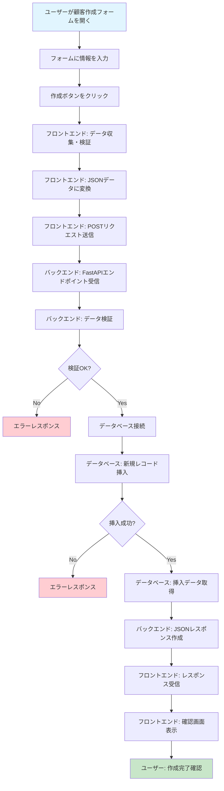
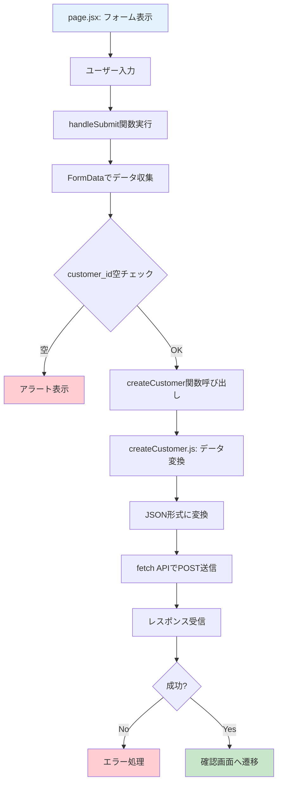
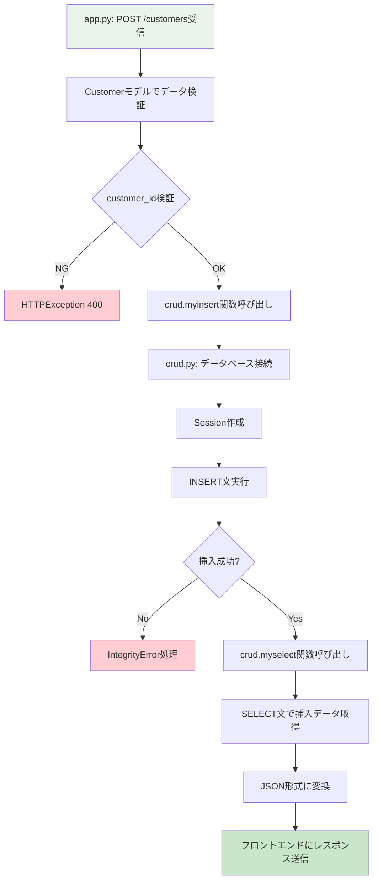
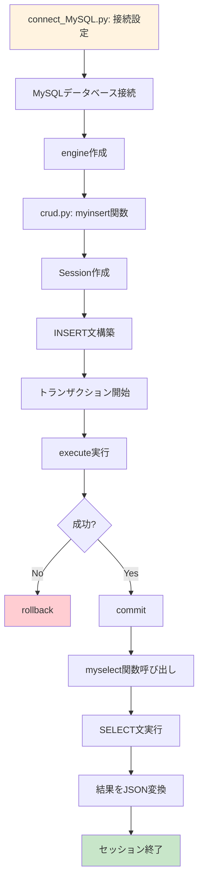
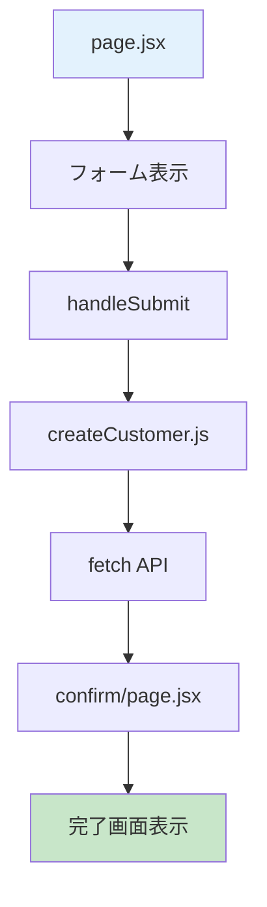
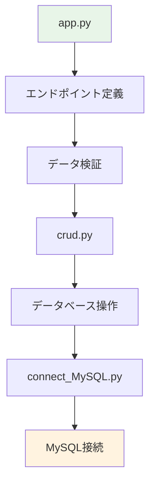
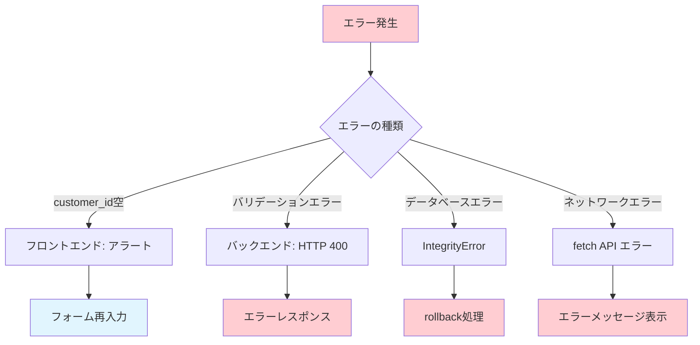

# LinkFastAPINext_Practical-main の「create機能」プロセスフロー図

## 🎯 全体プロセスフロー

## 📋 詳細プロセスフロー

### 🔄 フロントエンド処理フロー

### 🖥️ バックエンド処理フロー

### 🗄️ データベース処理フロー

## 📊 データ変換フロー

```mermaid
flowchart LR
    A[フォーム入力] --> B[FormData]
    B --> C[JSON文字列]
    C --> D[HTTPリクエスト]
    D --> E[FastAPI受信]
    E --> F[Pydanticモデル]
    F --> G[辞書形式]
    G --> H[SQLAlchemy]
    H --> I[MySQLテーブル]
    I --> J[SELECT結果]
    J --> K[JSONレスポンス]
    K --> L[フロントエンド表示]
    
    style A fill:#e1f5fe
    style I fill:#fff3e0
    style L fill:#c8e6c9
```

## 🔧 ファイル別処理フロー

### 📁 フロントエンドファイル

### 📁 バックエンドファイル

## ⚠️ エラーハンドリングフロー

## 🎓 プロセスフロー図の説明

### 🔄 **フロントエンド処理**
1. **フォーム表示** → ユーザーが入力できる画面を表示
2. **データ収集** → フォームの情報を集める
3. **検証** → 必須項目が入力されているかチェック
4. **送信** → バックエンドにデータを送信

### 🖥️ **バックエンド処理**
1. **受信** → フロントエンドからのリクエストを受け取る
2. **検証** → データの形式や内容をチェック
3. **保存** → データベースに情報を保存
4. **取得** → 保存したデータを取得
5. **返送** → フロントエンドに結果を返す

### 🗄️ **データベース処理**
1. **接続** → MySQLデータベースに接続
2. **挿入** → customersテーブルに新しい行を追加
3. **取得** → 挿入したデータを取得
4. **終了** → 接続を閉じる

### ⚠️ **エラー処理**
- 各段階でエラーが発生した場合の処理も含まれています
- ユーザーに適切なエラーメッセージを表示
- データベースの整合性を保つための処理

このプロセスフロー図により、create機能の全体の流れと各段階での処理内容が視覚的に理解できるようになっています。 